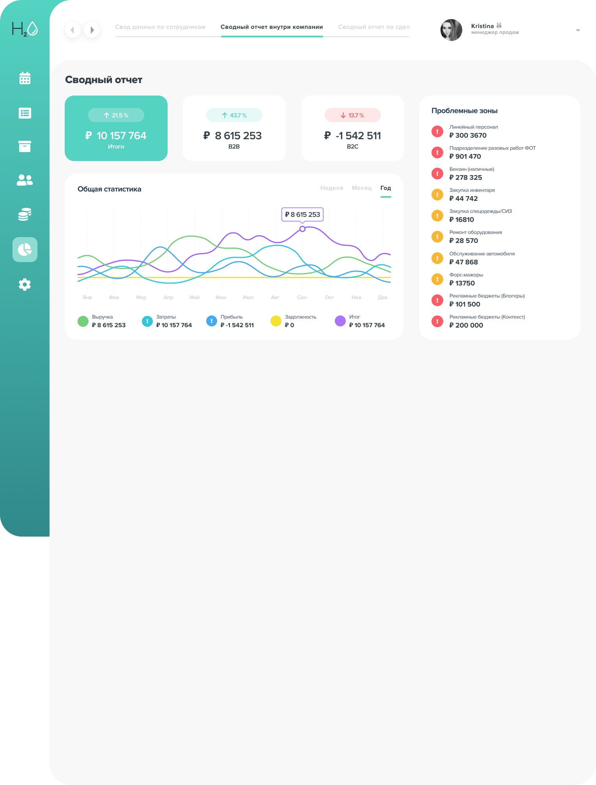

# H2O Test Assignment

This project is a test assignment for H2O company, implementing a financial dashboard with interactive charts and business metrics visualization.



## Tech Stack

- **Vite** - Next Generation Frontend Tooling
- **React 19** - A JavaScript library for building user interfaces
- **TypeScript** - JavaScript with syntax for types
- **SCSS** - CSS preprocessor with variables and mixins
- **Recharts** - Composable charting library built on React components
- **React Big Calendar** - Calendar component used in CalendarPage
- **Pragmatic Drag and Drop** - Drag and drop functionality for TaskListPage

## Features

- Interactive financial charts with multiple metrics
- Russian language interface
- BEM methodology for styling
- Color variables and theming support
- TypeScript type safety

## Installation

1. Clone the repository:

```bash
git clone https://github.com/Sigizmund2012/h2o-test.git
cd h2o-test
```

2. Install dependencies:

```bash
npm install
```

## Available Scripts

In the project directory, you can run:

### `npm run dev`

Runs the app in development mode.\
Open [http://localhost:5173](http://localhost:5173) to view it in the browser.

### `npm run build`

Builds the app for production to the `dist` folder.\
It correctly bundles React in production mode and optimizes the build for the best performance.

### `npm run lint`

Runs ESLint to check for code style issues and potential errors.

### `npm run preview`

Locally preview the production build.

## Project Structure

```
src/
  ├── components/     # React components
  ├── assets/        # Static assets
  ├── _variables.scss # Global SCSS variables
  └── main.tsx        # Entry point
```

## Author

Sigizmund2012

## License

This project is open source and available under the [MIT License](LICENSE).
